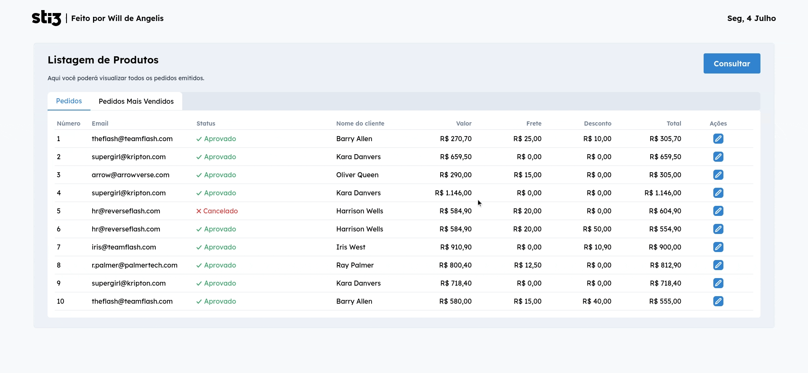

# Desafio STI3

O projeto consiste em uma aplicação web que ao consumir a API fornecida retornará uma Lista de Pedidos

## Demonstração

A homepage ou aba Pedidos mostra uma tabela contendo informações como Status, Nome, Valor, Desconto, Frete e Total.



Ao clicar no botão editar você é levado a pagina de Alteração


Onde você pode editar, cancelar e salvar as alterações do pedido.


A cada ação realizada uma notificação avisa sobre a ação escolhida.

Na aba Mais Vendidos você possui a opção de filtrar por categorias os itens mais Vendidos


Por unidades vendidas,valor total da compra e ordem alfabética dos produtos


## Funcionalidades

- Filtro de Produtos Mais Vendidos.
- Notificação a cada ação realizada na aba de alteração.
- Custom Hooks para formatação de valores, Data e fetching de dados da API.
- Rotas para as abas de Pedidos,Alteração e Mais Vendidos.

## Stack utilizada

**Front-end:** React, Context API, Vite

**Bibliotecas Utilizadas:** React Router Dom, React Query, React Toastify e styled-components

## Rodando localmente

Clone o projeto

```bash
  git clone https://link-para-o-projeto
```

Entre no diretório do projeto

```bash
  cd sti3
```

Instale as dependências

```bash
  npm install
```

Inicie o servidor

```bash
  npm run dev
```

Você também pode conferir o deploy na vercel :

## Screenshots da Telas


## Aprendizados

Ao longo do projeto pode aprender e melhorar meus estudos em várias bibliotecas e conceitos
do React.

-- O uso do Context API e como ele evitou o prop drilling em componentes.

-- A biblioteca React Query e como ela funciona. A chamadas a API foram bem tranquilas, a biblioteca facilita bastante nisso.

-- Styled Componentes o famoso CSS in JS é realmente bem útil e agiliza demais na criação de componentes de UI.

-- React Toastify foi o meu primeiro contato e decidi ter como aprendizado dela através da documentação, que é bem completa e simples.

-- Estrutura de Pastas no React, um dos meus principais focos foi a estrutura de pastas de uma forma que ficasse facil de se refatorar e ao mesmo tempo
não complicasse demais as coisas.

-- Outros aprendizados : Criação de Custom Hooks, Rotas, edição e manipulação de dados da API, Animações de entrada.

## Outras informações

API = https://desafiotecnicosti3.azurewebsites.net/pedido

Design no Figma = https://desafiotecnicosti3.azurewebsites.net/pedido

Video do APP = https://desafiosti3.blob.core.windows.net/dev/Exemplo_Front_End.mp4

PDF com Info = https://desafiosti3.blob.core.windows.net/dev/Desafio_Dev_Front-End_Javascript.pdf
